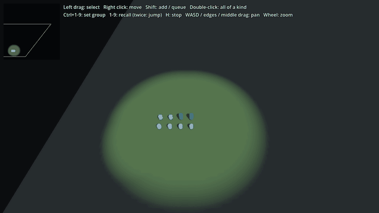

# RTS Kit for Godot 4

The parts every real-time strategy game has to rebuild, as a drop-in addon:
**box selection and orders, an RTS camera, fog of war, a minimap, and grid
pathfinding.** Pure GDScript, no dependencies, MIT licensed.



**[Play the demo in your browser](https://jhaney0214-sys.github.io/godot-rts-kit/)** (desktop, with a mouse; about 40 MB to load).

Extracted from **Drone Command**, a 3D RTS about drone warfare that I'm
building in Godot. Each system here was built for that game first and then
cut loose from it.

## What's in it

| Node | What it does |
|---|---|
| `RTSSelection` | Click, drag-box, Shift to add, double-click for every unit of a kind on screen. Right-click moves in formation or attacks, and Shift queues. Ctrl+1–9 saves control groups, 1–9 recalls them, and a double tap jumps the camera there. |
| `RTSCameraRig` | WASD, arrows, screen-edge and middle-drag panning, and wheel zoom. Clamped to the map, and `ground_at()` turns a screen point into a point on your terrain. |
| `RTSFogOfWar` | Visible, remembered and unexplored ground, with feathered edges. Drawn as a depth-aware full-screen pass, so units and props in the dark are shrouded too, not only the ground. Hides enemy units outside vision (which also makes them unclickable). Answers `visible_at()` and `explored_at()` for your own game logic. |
| `RTSMinimap` | Ground shaded by the fog, dots per team, and the camera's view frame. Click or drag to move the camera; right-click to order, exactly like a right-click on the world. |
| `RTSNavGrid` | A* on a grid, with routes pulled tight so a path round a wall is a few waypoints rather than a staircase. Bake it from your level's colliders or mark obstacles by hand. An unreachable goal ends at the nearest point that can be reached. |

## How many units?

[`benchmark/`](benchmark/) measures frame time against unit count, 100 to
8,000, for four ways of moving units in Godot 4: NavigationAgent3D with and
without avoidance, one path shared by a squad, and a flow field drawn with a
MultiMesh. On the machine it was run on, agents with avoidance fit about 4,000
units in a 60 fps frame, agents without it only just fit 8,000, and a shared
path or a flow field moves 8,000 in about a third of the frame.

## Install

Copy `addons/rts_kit` into your project. There is no plugin to enable: the
nodes are ordinary scripts with `class_name`, so they show up in the Add Node
dialog.

To try the demo, open this repository as a project and press Play, or
[play it in the browser](https://jhaney0214-sys.github.io/godot-rts-kit/). A browser keeps
Ctrl+1–9 for its own tabs, so control groups cannot be set there.

## Your units stay yours

The kit never asks your units to extend a base class. A unit is any `Node3D`
in the group `rts_units` with a `team` property. Everything else is optional
and found by name:

```gdscript
var team: int                  # required
var vision_radius: float       # lifts the fog around it
var unit_type: String          # what double-click selects all of
var rts_box_selectable: bool   # false keeps buildings out of box selection

func rts_set_selected(on: bool) -> void       # show a ring
func rts_move(point: Vector3, queued: bool) -> void
func rts_attack(target: Node3D) -> void
func rts_stop() -> void
func rts_is_alive() -> bool
```

If you'd rather handle orders yourself, connect to `RTSSelection.order_issued`
and leave the `rts_move` and `rts_attack` methods out.

## Minimal setup

```gdscript
const MAP := Rect2(-100, -100, 200, 200)

func _ready() -> void:
    var rig := RTSCameraRig.new()
    rig.bounds = MAP
    add_child(rig)

    var fog := RTSFogOfWar.new()
    fog.world_rect = MAP
    add_child(fog)

    var selection := RTSSelection.new()
    selection.camera_rig = rig
    add_child(selection)

    var minimap := RTSMinimap.new()
    minimap.world_rect = MAP
    minimap.size = Vector2(180, 180)
    $HUD.add_child(minimap)     # any CanvasLayer

    var nav := RTSNavGrid.new(MAP, 2.0)
    await get_tree().physics_frame
    nav.bake_from_physics(get_world_3d(), 2, 1.0)   # walls on layer 2
    # in a unit: var waypoints := nav.route(global_position, goal)
```

`demo/demo.gd` is the full version, with a working unit in `demo/demo_unit.gd`.

## Things to know

- **Keep your ground off the nav bake's collision mask.** The bake marks a cell
  solid wherever anything on the mask touches it, so ground on the same layer
  as the walls blocks everything. The demo puts ground on layer 1 and walls on
  layer 2.
- **The fog needs depth.** It reads the depth buffer, so anything drawn
  without writing depth (most transparent materials) is fogged by what is
  behind it. It has been checked in Forward+ and, since 2026-10-10, in the
  Compatibility renderer (desktop OpenGL and the browser demo), where the
  shroud works but blends differently: unexplored ground is black where
  Forward+ shows dark grey.
- **Fog vision is a circle.** Nothing blocks line of sight yet: a unit sees
  over walls.
- **The camera does not rotate.** Panning already respects the rig's yaw if
  you rotate it yourself.

## Tests

```bash
godot --headless --path . --import                    # once, on a fresh checkout
godot --headless --path . -s tests/run_tests.gd       # 29 checks
godot --headless --path . -s tools/arrival_check.gd   # units reach their orders
godot --path . -s tools/screenshot.gd                 # windowed: redraws docs/screenshot.png
godot --path . --fixed-fps 60 -s tools/record_gif.gd  # windowed: frames for the GIF, then
python tools/make_gif.py                              # docs/demo.gif (needs Pillow)
godot --headless --path . --export-release "Web" export/web/index.html   # the browser demo; needs the export templates
```

Tested on Godot 4.7.1.

## License

MIT. Use it in anything, commercial included.
