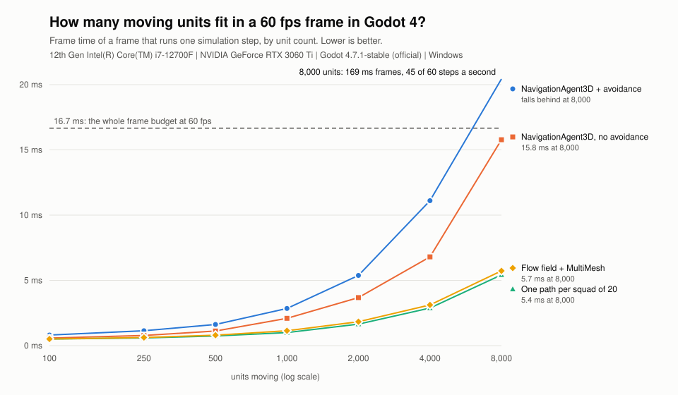

# How many moving units fit in a 60 fps frame in Godot 4?

A measured answer, for four common ways of moving units, from 100 to 8,000
units. One machine, stated below; run it on yours and the numbers will differ,
but the shape should not.



## What it found

On an i7-12700F with an RTX 3060 Ti, Godot 4.7.1, Forward+, Windows
([`results/2026-10-09.csv`](results/2026-10-09.csv)):

| Units | NavigationAgent3D + avoidance | NavigationAgent3D, no avoidance | One path per squad of 20 | Flow field + MultiMesh |
|---:|---:|---:|---:|---:|
| 100 | 0.81 ms | 0.58 ms | 0.51 ms | 0.51 ms |
| 500 | 1.62 ms | 1.12 ms | 0.74 ms | 0.80 ms |
| 1,000 | 2.85 ms | 2.09 ms | 1.00 ms | 1.14 ms |
| 2,000 | 5.38 ms | 3.68 ms | 1.65 ms | 1.83 ms |
| 4,000 | 11.11 ms | 6.80 ms | 2.88 ms | 3.12 ms |
| 8,000 | falls behind: 169 ms frames | 15.78 ms | 5.42 ms | 5.73 ms |

Each figure is the mean time of a frame that ran one simulation step. A 60 fps
game has 16.7 ms for the whole frame, so whatever the rest of your game needs
comes out of what is left.

- **Avoidance is the first wall.** Agents with avoidance cost 1.4 to 1.6 times
  as much as agents without it up to 4,000 units, then fall over: at 8,000 every frame
  had to run several steps to catch up, frames took 169 ms, and the simulation
  managed 45 of its 60 steps a second. The map is a fixed 200 x 200 m, so
  doubling the units doubles how crowded it is, and avoidance gets dearer
  faster than the count grows.
- **One NavigationAgent3D per unit, without avoidance, reaches 8,000 just
  inside the budget** (15.8 ms), which leaves nothing for the rest of a game.
- **Sharing one path between a squad, or reading a flow field, holds 8,000 at
  about 5.5 ms.** The two cost about the same to move: both are a GDScript
  loop over every unit, and that loop is the cost. What the MultiMesh saves is
  drawing: a frame with no simulation step took 0.68 ms with 8,000 units in one
  MultiMesh, and 1.00 ms with 8,000 separate MeshInstance3D nodes in the
  squad setup.

## The four setups

| Setup | File | Movement | Drawing |
|---|---|---|---|
| `agent_avoid` | [`agent_unit.gd`](agent_unit.gd) | each unit has a NavigationAgent3D with avoidance on, moved by `velocity_computed` | one MeshInstance3D per unit |
| `agent_plain` | [`agent_unit.gd`](agent_unit.gd) | the same, avoidance off, moved straight along the path | one MeshInstance3D per unit |
| `shared_path` | [`shared_path.gd`](shared_path.gd) | squads of 20; one `NavigationServer3D.map_get_path` per squad, units keep a slot in a block behind it | one MeshInstance3D per unit |
| `flow_multimesh` | [`flow_field.gd`](flow_field.gd) | units are plain data; each reads the direction stored in its cell of a precomputed flow field to one of four goals | one MultiMeshInstance3D, written as a single buffer each frame |

Every unit walks forever: to random points for the first three, between four
goals for the flow field. Eight walls stand on the map, and the camera looks
down on all of it, so every unit is drawn every frame.

## How it measures

Units move in `_physics_process` at 60 steps a second, while frames run
uncapped with vsync off, at thousands a second. Most frames only draw. A game
locked at 60 fps runs one step in every frame, so the benchmark sorts frames by
how many steps they ran:

- `tick_frame_ms`: frames that ran exactly one step. This is the figure above.
- `draw_ms`: frames that ran none; the cost of drawing alone.
- `step_ms`: the difference, roughly what one simulation step costs.
- `catchup_frames`, `catchup_ms`: frames that ran two or more steps because
  the simulation had fallen behind.
- `ticks_per_s`: steps actually run per second; under 60 means it could not
  keep up.

Each run warms up for 180 steps (3 seconds of simulation), so units have
spread out and are mid-route before anything is measured, then measures for
5 seconds. Two full runs on the same day agreed to within 5% from 1,000 units
up, and within 10% below that, where the frames are under a millisecond.

## What it leaves out

- **One machine.** A slower CPU moves every line up. Frames that ran no step
  stayed under 1 ms up to 2,000 units in every setup, so most of what grows
  is the cost of moving units, not of drawing them.
- **No game.** No combat, targeting, animation, physics bodies or AI
  decisions. Those come out of the same 16.7 ms.
- **The squad and flow-field units do not avoid each other**, and squad
  members follow a slot behind the squad's path, so a slot can clip a wall's
  corner. The agents with avoidance are doing more work, and look better for
  it. Compare like with like before choosing.
- **GDScript only.** Moving the squad or flow-field loop to C# or a GDExtension
  would lower those two lines; the agent setups' cost is mostly inside the
  engine and would change less.

## Run it

From the repository root, with Godot 4 on your PATH (it opens a window, since
drawing is part of what is measured):

```bash
godot --path . -s res://benchmark/bench.gd
godot --path . -s res://benchmark/bench.gd -- sizes=100,1000 setups=flow_multimesh seconds=3
python benchmark/chart.py benchmark/results/<date>.csv
```

Results go to `benchmark/results/<date>.csv`, with your CPU, GPU and Godot
version on the first line. `shots=1` also saves two screenshots a second apart
for each run, to check by eye that the units really move. If you run it,
please post your numbers: other hardware is the thing this is missing.

None of this ships with the addon: the Asset Library download carries only
`addons/`.
